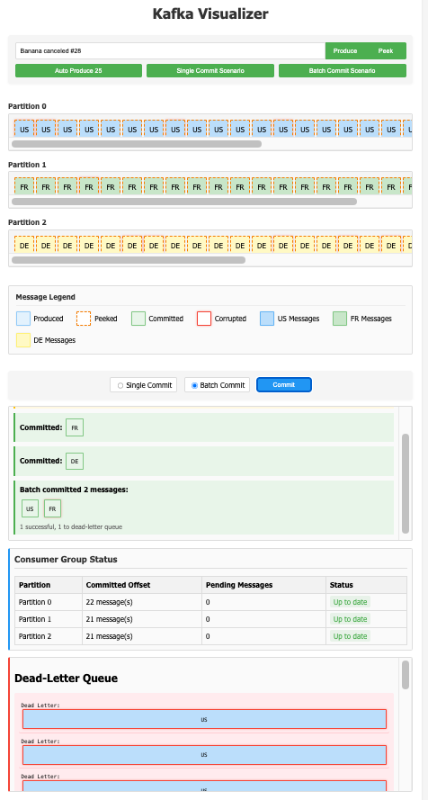

# Kafka Visualizer

## Overview
The Kafka Visualizer is a web application that demonstrates how Apache Kafka works, including message production, consumption, and partitioning. This project serves as a tutorial for users to learn about Kafka's architecture and functionality through a visual interface.

## Features
- **Message Production**: Users can produce messages to a Kafka topic with random or custom data.
- **Key-based Partitioning**: Messages are routed to specific partitions based on keys (US, FR, DE).
- **Partition Visualization**: Visualizes how messages are distributed across Kafka partitions in real-time.
- **Message Consumption**: Peek and commit messages with visual tracking of offsets.
- **Consumer Group Semantics**: Proper simulation of consumer groups and partition assignment.
- **Dead Letter Queue**: Visualizes how corrupted messages are handled (as an application pattern).
- **Consumer Group Status**: Real-time monitoring of consumer group offsets and pending messages.
- **Single vs Batch Commits**: Compare different commit strategies and their impact on message ordering.
- **Interactive Message Details**: Click on any message to see its complete details including Kafka headers.
- **Demo Scenarios**: Pre-built scenarios to demonstrate single and batch commit behaviors.


## Installation
1. Clone the repository:
   ```
   git clone <repository-url>
   cd kafka-visualizer
   ```

2. Install the dependencies:
   ```
   npm install
   ```

## Usage
1. Start the server:
   ```
   npm start
   ```

2. Open your web browser and navigate to `http://localhost:3000`.

3. Using the Interface:
   - **Produce Messages**: Enter a message in the input field or click to generate a random one, then click "Produce".
   - **View Partitions**: Messages appear in their respective partitions based on their keys.
   - **Peek Messages**: Click "Peek" to view the next available message without committing.
   - **Commit Messages**: Select single or batch commit mode, then click "Commit" to process the message(s).
   - **Run Scenarios**: Use the "Single Commit Scenario" or "Batch Commit Scenario" buttons to see different consumption patterns.
   - **View Message Details**: Click on any message to see its complete details in a popup.
   - **Monitor Consumer Status**: Track offsets and pending messages in the Consumer Group Status panel.
   - **Check Dead Letter Queue**: Corrupted messages are automatically moved to the Dead Letter Queue panel.



## How It Works
- **Key-based Partitioning**: Messages with key "US" go to partition 0, "FR" to partition 1, and "DE" to partition 2.
- **Consumption Order**: Messages are consumed in order within each partition, not across partitions (like real Kafka).
- **Consumer Group Management**: Offsets are maintained per consumer group, and partitions are assigned to consumers within a group.
- **Offset Management**: The consumer group tracks committed offsets per partition.
- **Message Headers**: Full support for Kafka message headers for metadata.
- **Corrupted Messages**: Approximately 25% of messages are randomly marked as corrupted for demonstration purposes.
- **Single vs Batch Commits**: Single commits process one message at a time; batch commits process all pending messages atomically by partition.

## Kafka Simulation Notes
This simulation accurately reflects several key Kafka behaviors:

1. **Partition Assignment**: Consumers in the same group are assigned specific partitions.
2. **Offset Tracking**: Offsets are maintained at the consumer group level, not per consumer.
3. **Message Headers**: Full implementation of Kafka message headers.
4. **Within-Partition Ordering**: Message order is only guaranteed within a partition, not across partitions.
5. **Batch Commit Semantics**: Batch commits are atomic per partition, not globally.

**Note about Dead Letter Queue**: The dead letter queue implementation is an application-level pattern, not a built-in Kafka feature. In real applications, dead letter handling would be implemented by the consuming application.

## Contributing
Contributions are welcome! Please open an issue or submit a pull request for any enhancements or bug fixes.

## License
This project is licensed under the Apache License 2.0. See the [LICENSE](LICENSE) file for details.